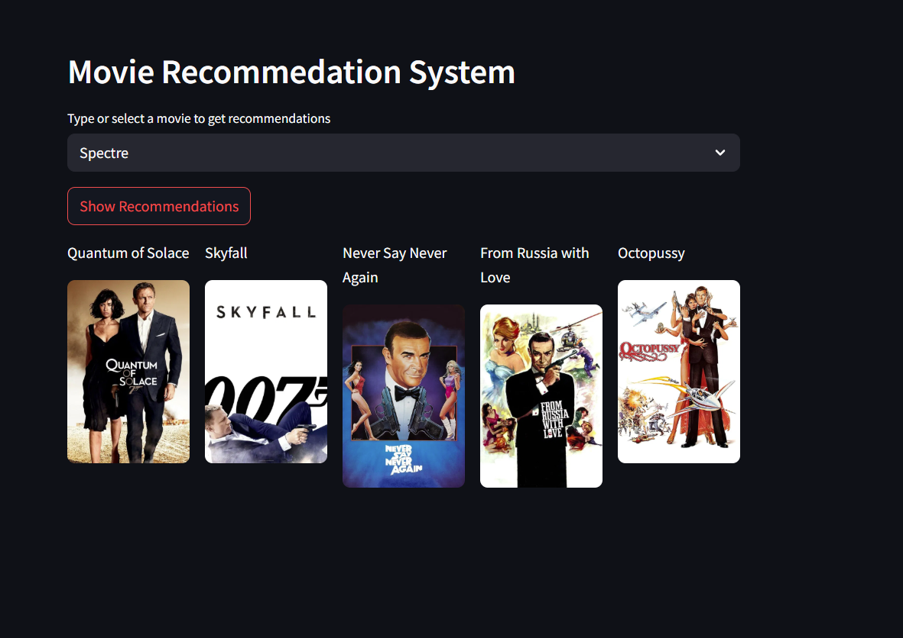
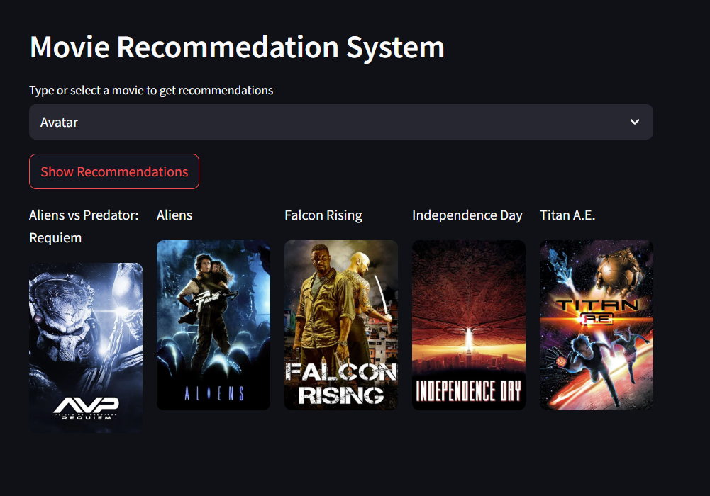

# Movie Recommendation System

A smart recommendation system that suggests movies using content-based filtering. It leverages the TMDB 5000 Movie Dataset from Kaggle to generate tailored recommendations.

## Setup & Usage
- **Dataset**: The TMDB dataset can be found [here](https://www.kaggle.com/datasets/tmdb/tmdb-movie-metadata?resource=download).
- **Processing**: `main.ipynb` is responsible for generating recommendations. To do this:
  - Place the dataset inside a folder named `database/`.
  - Run `main.ipynb` and the necessary pickle files will be generated in `recommendation_data/`.
- **App Execution**: `app.py` utilizes the generated files and the TMDB API to run the Streamlit app.
  - **Note:** Users must provide their own TMDB API key.

